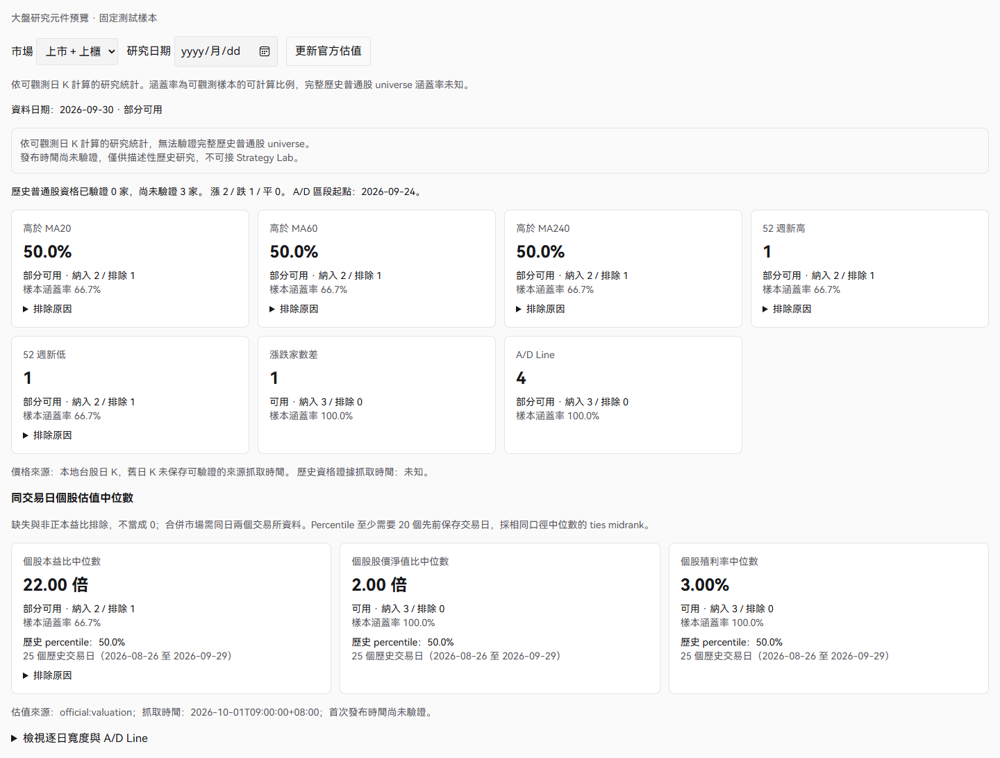
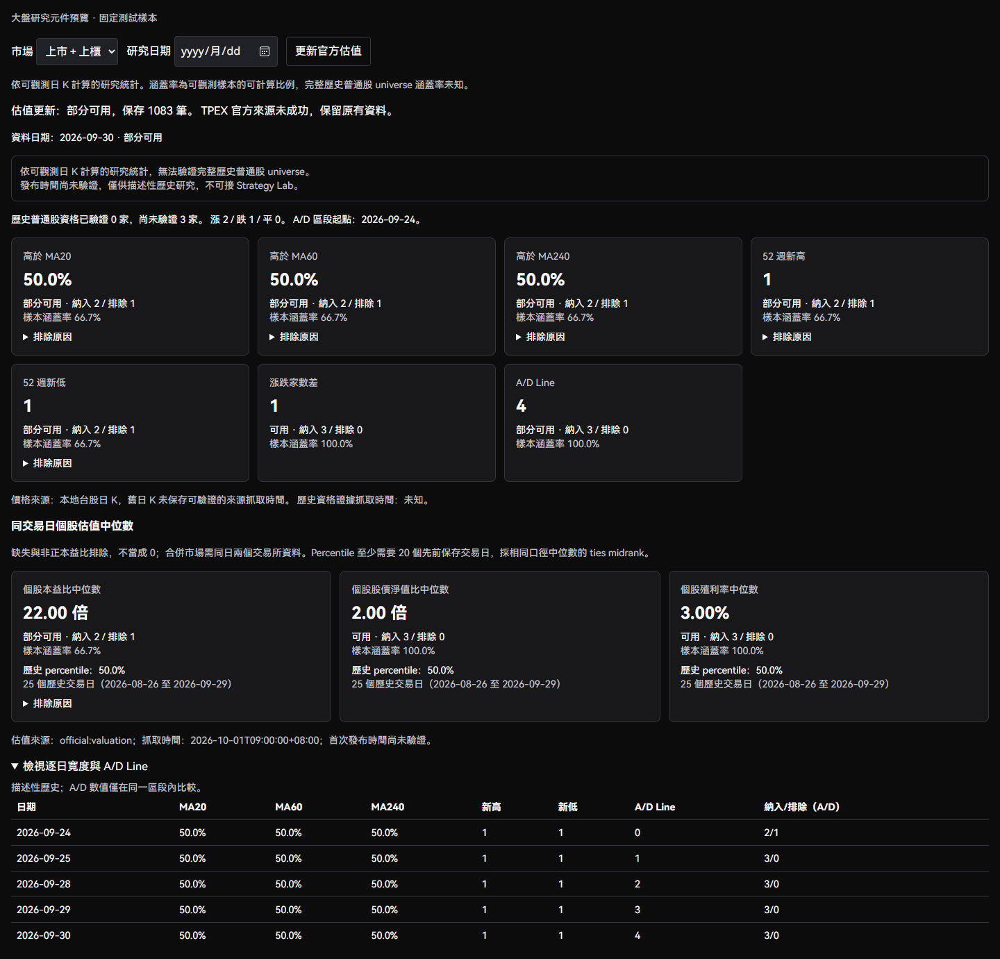
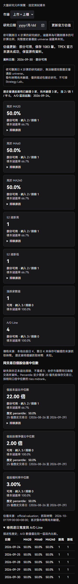

# ToAlpha v2.1 Phase 2：大盤寬度與估值

此功能提供描述性的大盤研究。價格來自既有 `TaiwanDailyStore`，資格證據來自
`PitUniverse` 的官方 census 與歷史 classification，交易日同時參照既有
`TaiwanTradingCalendar`、官方 census evidence 及 `TaiwanBenchmarkStore`。
不查今天的 security master 回填歷史資格，也不計算 precise index contribution points。

## API 與大盤研究 tab 接入

- `GET /api/taiwan/market-research/breadth-valuation?market=composite&days=20&as_of=2026-09-30&sections=all`
  僅讀本地資料，`market` 支援 `TWSE`、`TPEX`、`composite`，`days` 為 1–60 個已觀測交易日。
  `sections=breadth|valuation|all` 預設 `all` 保持舊呼叫相容；回應的 `sections` 明示未查詢部分。
  `valuation` 只讀保存的基本面與單日價格分母，不載入 census、歷史分類、公司行動或寬度。
  指定估值日期不替換成較早日期；未指定時採該市場最新已保存估值日期。
- `POST /api/taiwan/market-research/breadth-valuation/refresh` 明確更新兩個交易所最新個股估值。
  每個交易所一個限流請求，寫入既有 `TaiwanFundamentalStore`；失敗的交易所保留原紀錄。
  改變的估值以內容雜湊 revision 保存，不把抓取時間推定為發布時間。
- 已整合 Phase 1 的 `/market-research` shell，沿用 `tab=breadth` 與 `tab=valuation`。
  日期 `date` 與市場 `market` 保留於 URL。兩分頁共用元件，透過 `view` 選擇內容及獨立 section query；
  估值不等待寬度，法人與產業輪動入口保留，沒有第二個頁面或路由。
- 契約版本為 `contract_version: 1`。API client 經 `lib/api.ts`，query key 集中於 `QK`，
  包含日期、市場、歷史長度與 section。官方估值更新後使相關 query 失效；資料健康的 daily 更新
  沿既有 invalidation prefix 失效。手動重新讀取與焦點返回後的 stale query 重讀皆保留。
  公司行動 coverage 在 process 內以事件檔和 coverage marker 的 generation 安全重用，最多 8 個資料根；
  檔案替換、修改或 marker 變更即失效。價格檢查與 normalization 只在單次不可變輸入請求內重用。

## 寬度計算與 coverage

- MA20、MA60、MA240：當日 normalization 後收盤價嚴格大於含當日在內的 N 個交易日平均價，
  回傳 0–1 比例。相等不計入上方。
- 52 週新高／新低：涵蓋之前 52 個自然週，以窗口起點之前最近交易日為邊界；
  當日調整後 high／low 嚴格突破之前窗口 high／low。至少有完整年度窗口才可納入。
- A/D Net：當日調整後 close 與前一個交易日 close 比較，漲為 +1、跌為 -1、平為 0。
  A/D Line 累計本次查詢窗口的 A/D Net，`ad_segment_start` 明示區段起點。無法比較的日子
  回傳 null，下一個可比較日重起區段。不同起點的 A/D 絕對水位不可直接比較。
- 每個指標各自回傳 `included_count`、`excluded_count`、`excluded_reason_counts`、`coverage`、`status`。
  同一股票可能納入 MA20、排除 MA240。零樣本的 coverage/value 為 null，合法的 0 則保留。
- 分母是當日可觀測日 K 標的與當日已驗證且出現在 census 的普通股聯集，排除數為分母內
  無法計算的標的數。已驗證的非普通股排除；資格未確認的日 K 樣本仍只能作可觀測研究。
  合併市場缺少一方樣本時透過 `missing_markets` 標記，其指標最多為 partial。
- 新上市／歷史不足、缺交易日日 K、無效價、交易日窗口未確認、非普通股、公司行動證據不足、
  不可比較公司行動，均有獨立原因。未知交易日不以自然日或下一個有效日替換。
- 只呼叫現有 `CorporateActionStore.read_verified_coverage` 與 `adjust_prices_as_of`。
  缺少窗口涵蓋證據不能視為「沒有公司行動」；事件不可靠時標的 excluded/incomparable，
  不自行實作調整公式，也不改寫 raw 日 K。

`historical_eligibility_status=verified` 只表示分母內標的歷史資產資格有既有證據；
**不代表完整歷史普通股 universe**。停牌、已下市或來源漏列標的可能根本不在日 K/census。
因此永遠保留 `universe_complete=false`、`universe_status=observed` 及
「依可觀測日 K 計算的研究統計」。全市場完整涵蓋率未知，畫面中的 coverage 是樣本可計算比例。

## 估值與時間契約

官方來源為 TWSE `exchangeReport/BWIBBU_ALL` 與 TPEx `tpex_mainboard_peratio_analysis`，
重用 `TaiwanOfficialFundamentals` 的個股解析。TWSE、TPEx 分別計算 PE、PB、殖利率中位數；
composite 將**同一交易日**兩個交易所個股合併後取中位數，少一方則不可計算，禁止混日。
這些值不等於市值加權市場估值或官方指數本益比。

PE/PB 缺值、非有限值與非正值排除，虧損或缺 PE 不當成 0；殖利率 0 是合法資料。
估值分母為當日官方估值紀錄與日 K 樣本聯集，明確計數沒有估值紀錄的樣本。
Percentile 比較查詢日以前已保存的每日同口徑中位數，至少需要 20 個交易日；
相同值採 midrank，平坦歷史為 50%。回傳樣本數、起訖日；不含未來日期或當日，
同日多個 revision 只取最後抓取的一筆。歷史樣本組成可變，仍屬描述性研究。

估值紀錄保存 source、source_url、period_end（API as_of）、retrieved_at，available_at
沿用可驗證的來源契約。這兩個官方端點只有交易日，無法證明首次發布時間，因此目前
`available_at=null`、`publication_time_status=unverified`，只提供 `descriptive_history`，
`strategy_lab_eligible=false`，沒有接入 Strategy Lab 或聲稱 Historical PIT。
舊日 K schema 沒有保存來源抓取時間，不能用檔案 mtime、quote_ts、census 抓取時間或
generated_at 假造：價格 retrieved_at 為 null，狀態明示 unavailable；資格證據抓取時間
獨立放在 `eligibility_retrieved_at`。歷史 publication time 未確認不妨礙描述性研究。

首次更新只建立最新官方估值快照，歷史 percentile 會顯示「歷史不足」，不回填猜測的歷史估值。
明確指定日期沒有同日估值時回傳不可用；寬度若只有較早快照，保留實際 as_of 並標 stale。
`status` 只描述 available/partial/unavailable，`stale` 為獨立布林值，不能覆蓋不可用狀態。
歷史日期估值使用目前保存的最新 revision，非 Historical PIT，UI 明示此限制。
讀取時不建立網路 fallback、不自動回算或覆蓋既有 runtime data。

## 驗證與限制

固定樣本測試涵蓋 MA 數值、IPO、52 週窗口、缺日、無效價、非普通股、verified 資格不等於
完整 universe、公司行動 normalization 與失敗隔離、A/D 中斷、PE 缺值／非正值、同日 composite、
percentile ties／未來日期／revision、官方來源錯誤與持久化、空／錯 API 及零 HTTP GET。
前端測試涵蓋 context 切換、coverage／排除／provenance、加載、空、錯誤重試、stale、更新禁用與失效。

Phase 1 shell 已合入 feature branch，整合未合併至 main。
已有 price/census/classification/action coverage 決定實際可用範圍；缺少證據會明確降級，不宣稱資料完整。

## 元件畫面證據

以下為後端模型產生的固定測試樣本，並非正式市場數據。未新增產品頁面，暫時預覽 harness 已在驗證後移除。

## WP0 效能驗收（2026-10-01）

同一台 Windows 辦公室機、同一份正式資料、`as_of=2026-09-29`、`market=composite`、
`sections=all`，各次量測使用新 Python process（公司行動 process cache 為冷快取）。
基線為 `584f7e5`；未修改正式資料。數字是這台機器的實測，不是通用延遲保證。

| 查詢 | 修正前 | 修正後 | 減少 |
| --- | ---: | ---: | ---: |
| days=1 | 51.11 秒 | 19.39 秒 | 62.1% |
| days=20 | 249.50 秒 | 36.79 秒 | 85.3% |

單日 cProfile（含 profiler 額外成本）：整體 42.53 → 23.73 秒；`calculate_breadth`
19.25 → 12.81 秒；`read_verified_coverage` 13.37 → 4.69 秒；公司行動 content hash
11.11 → 2.78 秒；session 查詢 4.27 → 0.70 秒。歷史 partition status 讀取由 6,144 次降至
本次窗口的 786 次。共用 `partition_statuses()` 語意不變。

修正範圍：bounded census evidence、分類/census 批次讀取、immutable scalar 序列化、
事件/marker generation 快取、每市場/日期共用 calendar/window、最長已驗證價格窗口重用。
跨日重用只允許向後延伸且沒有新生效事件；新事件、失敗窗口、往前查詢均重新驗證。
調整公式仍由 `adjust_prices_as_of` 唯一負責，沒有新增跨請求的價格/結果快取。

- Canonical output equality：正式資料 1 日、20 日 PASS，涵蓋 7／140 個非空寬度數值。
  僅移除時間戳 `generated_at` 與新增的 section echo，所有既有欄位完全一致。
- 非空固定樣本：5 個標的、300 個交易日，涵蓋漲跌、IPO、缺日、ETF、新公司行動與估值 revision。
  基線程式碼與修正後 20 日的全部 JSON 相等，140 個寬度數值、3 個估值和 percentile 皆非空。
  Canonical SHA-256：`24b0659b7cfeb7197a1f38024eb1bdd830ad185e8d438be5f79a9afbf36dd2b9`。
- 後端 targeted regression：230 PASS，含 Phase 1、PIT adjustment/universe、census、fundamentals、daily store、corporate actions。
- 前端完整測試：391 PASS；最後文案調整後 14 項元件/shell 測試 PASS。
- Ruff、8 個模組 mypy、TypeScript、production build PASS。ESLint 0 errors、16 個既有 warnings；build 保留既有 chunk warning。
- Desktop/WebView2 使用 production build 和正式公開資料的隔離副本；20 日非空寬度、估值官方更新
  1,970 筆、日期/市場切換、歷史展開、深淺色、390px、錯誤重試及 Phase 1 分頁 smoke PASS。
  breadth 仍在計算時 valuation API 約 0.21 秒返回；未把此數字當作完整寬度耗時。
- 7,288 個正式輸入檔案的 size/mtime 指紋前後不變；changed-file privacy/secret scan 40 檔 PASS。
  實機截圖與詳細 profiler 留在本機驗收目錄，不包含在 Git。

本機正式資料公司行動 coverage 只到 2026-09-29，較新寬度仍 fail-closed；沒有保存的估值
與不足 20 日的 percentile 明確不可用。20 日冷查詢仍需數十秒，未宣稱即時。

估值自動累積留在 WP0 #59 runtime cleanup：既有盤後 scheduler 尚無估值完成通知與對應
跨頁 query invalidation，須與 runtime 刷新一致性一起處理。本 PR 保留手動官方更新，
不接 `/bootstrap/update-latest`，不建立新的 scheduler framework。
